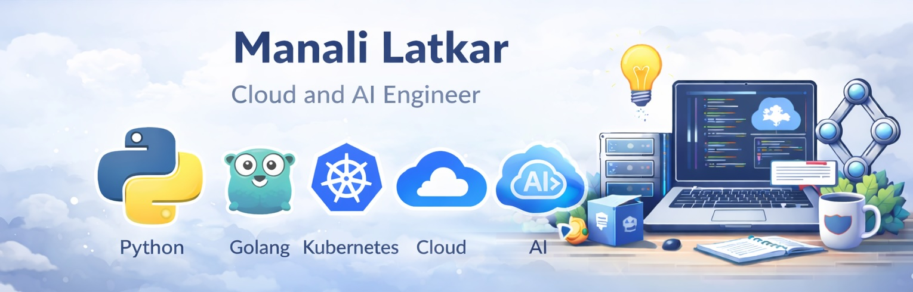

  

# 👋 Hi, I’m Manali — Senior Software Engineer (8+ Years)

**Python • Golang • Kubernetes • Cloud • AI**

I’m a Senior Software Engineer with 8+ years of experience building scalable, production-grade systems across Python, AI/ML platforms, Golang, and cloud-native infrastructure. 

I enjoy working at the intersection of software engineering and applied AI, turning complex ideas into reliable, high-impact solutions.

## 🚀 What I Work On

- Python at scale – high-performance services, concurrency, optimization, testing, and clean architecture 
- AI / LLM Systems – RAG pipelines, evaluation frameworks, golden datasets, agentic workflows, autonomous testing, fine-tuning
- Golang – backend services, tooling, concurrency-driven systems, and cloud integrations 
- Kubernetes & Cloud-Native – containerized workloads, CI/CD, Helm, Docker, and production deployments 
- System Design – performance tuning, reliability, testability, and maintainability for long-running systems

## 🧠 Engineering Philosophy

- Strong believer in engineering rigor for AI systems — testing, metrics, evaluation, and guardrails matter 
- Prefer simple, explicit designs over clever but fragile abstractions 
- Passionate about automation: if it’s repetitive, it should be codified 
- Value clear documentation and readable code as much as raw performance
- Vibe coding: You are responsible for every line of code even if it is generated by the best AI.

## 🛠️ Tech Stack

- Languages: Python, Go, Ruby
- AI/ML: LLMs, RAG, LangGraph, fine-tuning, QA & evaluation pipelines
- Cloud & Infra: Kubernetes, Docker, Helm, CI/CD (Jenkins, GitHub Actions), Linux
- Dev Practices: Testing, performance optimization, distributed systems

## 📌 On GitHub You’ll Find

- AI engineering experiments and production-oriented patterns
- Autonomous agents, RAG systems, and evaluation tooling
- Backend services and infrastructure-as-code 
- Clean, well-documented code focused on real-world use cases

## 🌱 Recent Personal Projects I have worked on:
- 🧠 [a digital memory tool to remember information using a whatsapp interface](https://github.com/manalilatkar/digital-memory-tool)
- 📊 [a tool to generate golden dataset by finetuning a model](https://github.com/manalilatkar/AI-tools/tree/main/golden-dataset-generation)
- 🔍 [a deep research agent to help you research a specific website](https://github.com/manalilatkar/AI-tools/tree/main/deep-research-agent)

## 📫 Let's Connect

- 💼 **LinkedIn**: [manalilatkar](https://www.linkedin.com/in/manali-latkar-844846100/)
- 💬 I’m always interested in challenging problems around scalable systems, AI engineering, and cloud-native platforms.